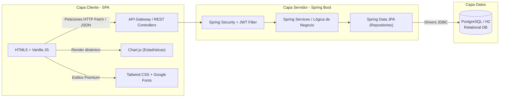

# 🏠 Documento de Trabajo Final — RentShare
**Asignatura:** Programación Web  
**Proyecto:** RentShare — Sistema Integral de Gestión de Cohabitación y Gastos Compartidos  

---

## 📝 1. Información General del Proyecto

### Nombre del Sistema
**RentShare**

### Descripción General
RentShare es una plataforma web completa (Full-Stack) diseñada para resolver el problema de la cohabitación (roommates o pisos compartidos). Permite a los inquilinos administrar de forma transparente los gastos del hogar, automatizar y dividir cuentas equitativamente, asignar calendarios de tareas del hogar, controlar el inventario de insumos comunes (como víveres o artículos de limpieza), y visualizar estadísticas financieras mediante reportes avanzados.

### Objetivos del Proyecto
* **Objetivo General:** Diseñar, desarrollar e implementar un sistema web integral bajo la arquitectura cliente-servidor para la gestión eficiente y justa de la cohabitación, garantizando la consistencia de datos, seguridad de la información y una experiencia de usuario responsiva de primer nivel.
* **Objetivos Específicos:**
  1. Construir una API REST robusta en el backend para gestionar la lógica de autenticación, gastos, balances, tareas e inventarios.
  2. Implementar una base de datos relacional normalizada y optimizada con relaciones lógicas correctas.
  3. Crear una interfaz frontend interactiva, responsive y atractiva utilizando tecnologías modernas de diseño que consuma los recursos de la API en tiempo real.
  4. Desarrollar un motor de cálculo matemático para resolver la distribución de deudas y saldos en un grupo de inquilinos.

---

## 👥 2. Roles del Sistema

El sistema implementa de forma robusta la gestión de roles a nivel de grupo, adaptando la interfaz y los permisos según el rol del usuario actual:

| Rol | Descripción | Permisos Clave |
|---|---|---|
| **Administrador (`ADMIN`)** | El usuario que crea el grupo o departamento. Tiene el control total de la administración del hogar. | • Generar códigos seguros de invitación.<br>• Aprobar o denegar solicitudes de unión.<br>• Crear, editar y eliminar gastos del grupo.<br>• Eliminar tareas y controlar el inventario compartido. |
| **Miembro (`MEMBER`)** | Inquilino que se ha unido al grupo mediante un código de invitación aprobado. | • Visualizar el historial y detalles de gastos del grupo.<br>• Marcar deudas propias como pagadas.<br>• Consultar el balance general (quién debe a quién).<br>• Crear tareas, asignar tareas, y registrar o actualizar existencias en el inventario.<br>• Consultar reportes y estadísticas en tiempo real. |

---

## 🧬 3. Entidades del Sistema (Cumpliendo las 5 requeridas)

El sistema supera el requisito mínimo de 5 entidades principales, gestionando un total de **8 entidades lógicas** fuertemente relacionadas:

1. **Usuario (`usuarios`):** Representa a las personas registradas en la aplicación (ID UUID, Nombre, Email, Password encriptada, Rol global).
2. **Grupo (`grupos`):** Representa a un departamento o casa compartida (ID, Nombre, Descripción, ID Creador).
3. **Miembro del Grupo (`miembros_grupo`):** Entidad asociativa (relación muchos a muchos entre Usuario y Grupo) que almacena el rol correspondiente del usuario dentro del grupo específico (`ADMIN` o `MEMBER`).
4. **Invitación (`invitaciones_grupo`):** Administra los códigos temporales y las solicitudes de usuarios que desean unirse a un departamento (Código seguro, Solicitante, Estado de aprobación).
5. **Gasto (`gastos`):** Almacena la cabecera de los egresos generados en el grupo (Monto total, Título, Descripción, Pagador, Categoría, Tipo de gasto, Fecha).
6. **División de Gasto (`divisiones_gasto`):** Detalla la repartición individual del gasto (Usuario asignado, Monto a pagar, Estado de pago: `true` o `false`).
7. **Tarea (`tareas`):** Controla las tareas del hogar asignadas (Título, Descripción, Fecha de vencimiento, Estado de avance, Usuario asignado).
8. **Item Inventario (`inventario`):** Administra el stock común de víveres o aseo (Nombre, Cantidad actual, Unidad de medida, Stock mínimo para alerta de reposición).

---

## 🧮 4. Módulo de Lógica de Negocio (Más allá de un CRUD)

El corazón analítico de RentShare es el **Motor de División de Gastos y Cálculo de Balances**. No es una simple persistencia CRUD; realiza los siguientes cálculos dinámicos:

### A. Repartición Equitativa e Individualizada
Al guardar un gasto, el usuario ingresa un monto total y puede elegir repartirlo de manera igualitaria o asignar una cantidad específica a cada miembro participante. El sistema valida en frontend y backend que:
$$\sum \text{Monto Asignado} = \text{Monto Total del Gasto}$$

### B. Algoritmo de Cálculo de Balance de Cuentas
Para cada usuario del grupo, el sistema calcula en tiempo real dos métricas:
1. **Total Pagado ($P$):** Sumatoria de los montos de los gastos donde el usuario fue el pagador directo.
2. **Total Debido ($D$):** Sumatoria de los montos asignados al usuario en todas las divisiones de gastos en las que participa.

El **Balance ($B$)** de un usuario se define como:
$$B = P - D$$

* **Si $B > 0$:** Al usuario **le deben** dinero. El sistema renderiza visualmente su saldo en color verde (`--success`) con el mensaje *"Le deben $X"*.
* **Si $B < 0$:** El usuario **debe** dinero. El sistema renderiza visualmente su saldo en color rojo (`--error`) con el mensaje *"Debe $X"*.
* **Si $B = 0$:** El usuario está totalmente **al día** (color neutro y check verde).

Este algoritmo evita transacciones repetitivas entre todos los inquilinos, resumiendo la deuda neta general de cada uno de manera centralizada.

---

## ⚙️ 5. Arquitectura y Detalles Tecnológicos

El sistema implementa una arquitectura desacoplada **Cliente-Servidor (SPA + API REST)**:



### 🔹 Backend (API REST)
* **Framework:** Spring Boot (Java 17).
* **Seguridad y Autenticación:** Spring Security con validación de tokens **JWT (JSON Web Tokens)** sin estado. La contraseña se encripta mediante hash seguro.
* **Integración Anti-Bot:** Implementación de **Google reCAPTCHA Enterprise** en el controlador de registro e inicio de sesión.
* **Persistencia:** Spring Data JPA con Hibernate para el mapeo objeto-relacional (ORM).

### 🔹 Frontend (SPA Responsiva)
* **Paradigma:** Single Page Application (SPA) para navegación fluida y sin recargas de página.
* **Estilos y Estética:** Tailwind CSS mediante CDN con variables del tema personalizadas inspiradas en **Material Design 3** y hermosos acabados en **Glassmorphic** para la pantalla de inicio de sesión. Soporte nativo para alternar dinámicamente entre **Modo Claro** y **Modo Oscuro**.
* **Gráficas y Estadísticas:** Integración avanzada de la librería **Chart.js** para renderizar dinámicamente gráficos de dona (Gastos por Categoría) y de barras (Gastos por Usuario).

### 🔹 Base de Datos
* **Motor:** PostgreSQL (Producción) / H2 Database (Desarrollo).
* **Modelo Relacional:** Normalizado con claves primarias autogeneradas por **UUID** para evitar vulnerabilidad de enumeración de IDs secuenciales.
* **Rendimiento:** Creación de índices específicos en base de datos para optimizar las consultas de búsquedas y uniones (`miembros_grupo`, `gastos`, `divisiones_gasto`).

---

## 🔌 6. Rutas de la API (Endpoints REST)

| Módulo | Método | Endpoint | Descripción | Requiere JWT |
|---|---|---|---|---|
| **Autenticación** | `POST` | `/api/v1/auth/register` | Registro de nuevos usuarios con token de captcha | No |
| | `POST` | `/api/v1/auth/login` | Login de usuario. Retorna datos del usuario y token JWT | No |
| **Grupos** | `POST` | `/api/v1/grupos` | Crea un nuevo grupo de inquilinos (el creador se asigna como `ADMIN`) | Sí |
| | `GET` | `/api/v1/grupos/mis` | Lista los grupos a los que pertenece el usuario autenticado | Sí |
| | `GET` | `/api/v1/grupos/{id}/miembros` | Retorna el listado de miembros del grupo con sus respectivos roles | Sí |
| | `POST` | `/api/v1/grupos/{id}/invitacion` | Genera un código de invitación seguro para unirse al grupo | Sí |
| | `POST` | `/api/v1/grupos/unirse` | Envía una solicitud de unión ingresando un código de invitación | Sí |
| | `GET` | `/api/v1/grupos/{id}/solicitudes` | Retorna la lista de solicitudes pendientes de aprobación (Solo `ADMIN`) | Sí |
| | `POST` | `/api/v1/grupos/solicitudes/{id}/responder` | Acepta o rechaza la solicitud de unión de un usuario (Solo `ADMIN`) | Sí |
| | `GET` | `/api/v1/grupos/{id}/balance` | Retorna el balance calculado de deudas y saldos del grupo | Sí |
| **Gastos** | `GET` | `/api/v1/gastos` | Lista los gastos del grupo, con soporte de filtrado por categoría | Sí |
| | `POST` | `/api/v1/gastos` | Registra un nuevo gasto y distribuye las divisiones en la BD | Sí |
| | `DELETE` | `/api/v1/gastos/{id}` | Elimina un gasto del grupo (Permitido al pagador o al `ADMIN`) | Sí |
| | `PATCH` | `/api/v1/gastos/{id}/pagar` | Marca como pagada la porción del gasto correspondiente al usuario | Sí |
| **Tareas** | `GET` | `/api/v1/tareas` | Retorna el listado de tareas asignadas al grupo | Sí |
| | `POST` | `/api/v1/tareas` | Crea una nueva tarea asignándola a un miembro del grupo | Sí |
| | `PATCH` | `/api/v1/tareas/{id}/estado` | Cambia el estado de la tarea (ej: de PENDIENTE a COMPLETADA) | Sí |
| | `DELETE` | `/api/v1/tareas/{id}` | Elimina una tarea del grupo | Sí |
| **Inventario** | `GET` | `/api/v1/inventario` | Retorna el catálogo de insumos del grupo con alerta de stock bajo | Sí |
| | `POST` | `/api/v1/inventario` | Agrega un nuevo producto o actualiza su definición | Sí |
| | `PATCH` | `/api/v1/inventario/{id}/cantidad` | Incrementa o decrementa la cantidad física de un producto | Sí |
| | `DELETE` | `/api/v1/inventario/{id}` | Elimina un producto del catálogo de inventario | Sí |
| **Reportes** | `GET` | `/api/v1/reportes/stats` | Retorna sumatorias y diccionarios agrupados para alimentar gráficas | Sí |

---

## 🗃️ 7. Script de Estructura de Base de Datos (DDL)

```sql
-- ============================================================
-- RentShare - DDL Completo de Base de Datos Relacional
-- ============================================================

CREATE EXTENSION IF NOT EXISTS "uuid-ossp";

-- 1. Tabla: usuarios
CREATE TABLE usuarios (
    id UUID PRIMARY KEY DEFAULT uuid_generate_v4(),
    nombre VARCHAR(100) NOT NULL,
    email VARCHAR(150) UNIQUE NOT NULL,
    password VARCHAR(255) NOT NULL,
    rol VARCHAR(20) DEFAULT 'USER',
    fecha_creacion TIMESTAMP WITH TIME ZONE DEFAULT CURRENT_TIMESTAMP
);

-- 2. Tabla: grupos
CREATE TABLE grupos (
    id UUID PRIMARY KEY DEFAULT uuid_generate_v4(),
    nombre VARCHAR(150) NOT NULL,
    descripcion TEXT,
    creador_id UUID REFERENCES usuarios(id) ON DELETE SET NULL,
    fecha_creacion TIMESTAMP WITH TIME ZONE DEFAULT CURRENT_TIMESTAMP
);

-- 3. Tabla: miembros_grupo
CREATE TABLE miembros_grupo (
    id UUID PRIMARY KEY DEFAULT uuid_generate_v4(),
    grupo_id UUID REFERENCES grupos(id) ON DELETE CASCADE,
    usuario_id UUID REFERENCES usuarios(id) ON DELETE CASCADE,
    rol VARCHAR(20) DEFAULT 'MEMBER', -- 'ADMIN' o 'MEMBER'
    fecha_union TIMESTAMP WITH TIME ZONE DEFAULT CURRENT_TIMESTAMP,
    UNIQUE(grupo_id, usuario_id)
);

-- 4. Tabla: invitaciones_grupo
CREATE TABLE invitaciones_grupo (
    id UUID PRIMARY KEY DEFAULT uuid_generate_v4(),
    grupo_id UUID REFERENCES grupos(id) ON DELETE CASCADE,
    codigo VARCHAR(64) UNIQUE NOT NULL,
    solicitante_id UUID REFERENCES usuarios(id) ON DELETE CASCADE,
    estado VARCHAR(20) DEFAULT 'PENDIENTE', -- PENDIENTE, ACEPTADA, RECHAZADA
    fecha_expiracion TIMESTAMP WITH TIME ZONE,
    fecha_creacion TIMESTAMP WITH TIME ZONE DEFAULT CURRENT_TIMESTAMP
);

-- 5. Tabla: gastos
CREATE TABLE gastos (
    id UUID PRIMARY KEY DEFAULT uuid_generate_v4(),
    grupo_id UUID REFERENCES grupos(id) ON DELETE CASCADE,
    titulo VARCHAR(200) NOT NULL,
    descripcion TEXT,
    monto DECIMAL(10, 2) NOT NULL,
    pagado_por UUID REFERENCES usuarios(id) ON DELETE SET NULL,
    tipo VARCHAR(20) DEFAULT 'COMPARTIDO',
    categoria VARCHAR(30) DEFAULT 'OTRO', -- RENTA, SERVICIOS, MERCADO, LIMPIEZA, INTERNET, OTRO
    fecha_gasto DATE NOT NULL,
    fecha_creacion TIMESTAMP WITH TIME ZONE DEFAULT CURRENT_TIMESTAMP
);

-- 6. Tabla: divisiones_gasto
CREATE TABLE divisiones_gasto (
    id UUID PRIMARY KEY DEFAULT uuid_generate_v4(),
    gasto_id UUID REFERENCES gastos(id) ON DELETE CASCADE,
    usuario_id UUID REFERENCES usuarios(id) ON DELETE CASCADE,
    monto_assigned DECIMAL(10, 2) NOT NULL,
    pagado BOOLEAN DEFAULT FALSE,
    UNIQUE(gasto_id, usuario_id)
);

-- 7. Tabla: tareas
CREATE TABLE tareas (
    id UUID PRIMARY KEY DEFAULT uuid_generate_v4(),
    grupo_id UUID REFERENCES grupos(id) ON DELETE CASCADE,
    titulo VARCHAR(200) NOT NULL,
    descripcion TEXT,
    fecha_vencimiento TIMESTAMP WITH TIME ZONE,
    estado VARCHAR(20) DEFAULT 'PENDIENTE', -- PENDIENTE, COMPLETADA
    asignado_a UUID REFERENCES usuarios(id) ON DELETE SET NULL,
    creado_por UUID REFERENCES usuarios(id) ON DELETE SET NULL,
    es_recurrente BOOLEAN DEFAULT false,
    frecuencia VARCHAR(20),
    fecha_creacion TIMESTAMP WITH TIME ZONE DEFAULT CURRENT_TIMESTAMP
);

-- 8. Tabla: inventario
CREATE TABLE inventario (
    id UUID PRIMARY KEY DEFAULT uuid_generate_v4(),
    grupo_id UUID REFERENCES grupos(id) ON DELETE CASCADE,
    nombre VARCHAR(150) NOT NULL,
    cantidad DECIMAL(10, 2) DEFAULT 0,
    unidad VARCHAR(20) DEFAULT 'unidades',
    stock_minimo DECIMAL(10, 2) DEFAULT 0,
    ultima_actualizacion TIMESTAMP WITH TIME ZONE DEFAULT CURRENT_TIMESTAMP
);

-- Índices para Optimización y Rendimiento
CREATE INDEX idx_usuarios_email ON usuarios(email);
CREATE INDEX idx_miembros_grupo_grupo ON miembros_grupo(grupo_id);
CREATE INDEX idx_miembros_grupo_usuario ON miembros_grupo(usuario_id);
CREATE INDEX idx_gastos_grupo ON gastos(grupo_id);
CREATE INDEX idx_divisiones_gasto ON divisiones_gasto(gasto_id);
CREATE INDEX idx_tareas_grupo ON tareas(grupo_id);
CREATE INDEX idx_inventario_grupo ON inventario(grupo_id);
```

---

## 🎯 8. Mapeo del Proyecto a la Rúbrica de Calificación

RentShare fue diseñado estratégicamente para cumplir holgadamente con el 100% de los ítems obligatorios y sumar todos los puntos de la sección de **Requisitos adicionales (para mejor calificación ⭐)**:

| Criterio del Docente | ¿Cómo lo cumple RentShare? | Calificación Estimada |
|---|---|:---:|
| **API REST Backend** | Implementada al 100% con Spring Boot, controladores REST estructurados en la versión `/api/v1/` y respuestas en JSON. | **Excelente** |
| **Operaciones CRUD** | CRUDs completos implementados en Gastos, Tareas e Inventario. | **Excelente** |
| **Base de Datos Relacional** | Modelo relacional de 8 tablas con relaciones declaradas mediante llaves foráneas e índices optimizados en PostgreSQL. | **Excelente** |
| **Autenticación** | Sistema robusto con Spring Security + JWT sin estados y registro protegido por Google reCAPTCHA Enterprise. | **Excelente** |
| **Interfaz Responsive** | Interfaz SPA responsiva adaptada con Tailwind CSS. Sidebar fijo en Desktop y Bottom Nav táctil en Mobile. | **Excelente** |
| **Validación de Formularios** | Validaciones frontend antes de enviar registros y validaciones backend con anotaciones `@Valid` de Jakarta Validation. | **Excelente** |
| **Lógica de Negocio Avanzada** | Motor matemático de cálculo de balance consolidado ($B = P - D$) y algoritmo de repartición proporcional. | **Excelente** |
| **Dashboard con Estadísticas ⭐** | Bento grid dinámico que muestra resumen de grupos, grupos que administra e información centralizada. | **Puntos Extra ⭐** |
| **Reportes y Consultas Avanzadas ⭐** | Gráficas estadísticas en la pestaña de Reportes con **Chart.js** (distribución de gastos por categoría y por inquilino). | **Puntos Extra ⭐** |
| **Manejo de Roles y Permisos ⭐** | Restricciones estrictas según el rol (`ADMIN` vs `MEMBER`). Modales y botones administrativos ocultados por CSS/JS según el contexto. | **Puntos Extra ⭐** |
| **Notificaciones ⭐** | Sistema de notificaciones en pantalla mediante alertas tipo Toast dinámicas con clases de éxito (`success`), advertencia (`warning`) y error. | **Puntos Extra ⭐** |
